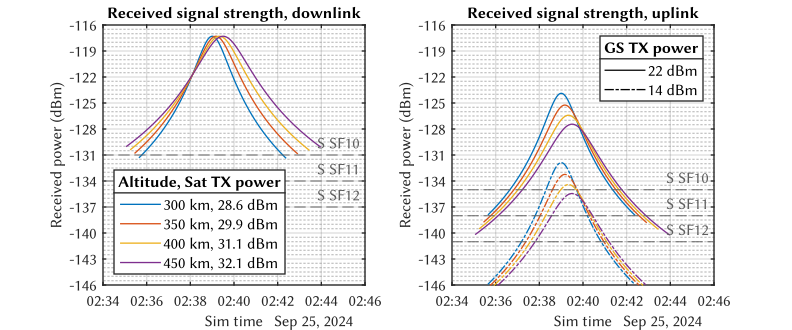
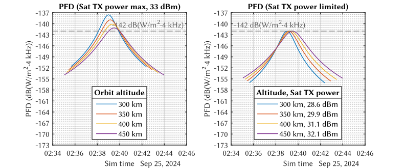
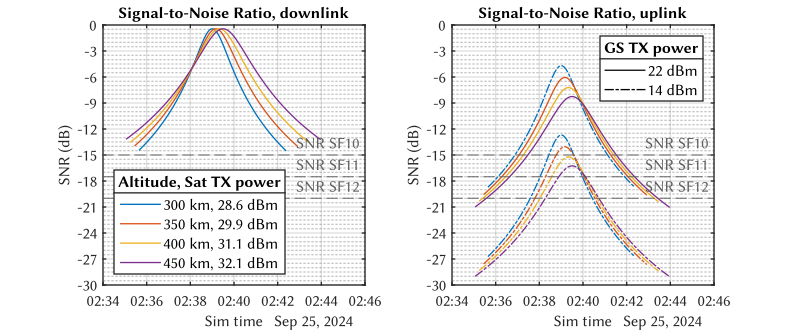
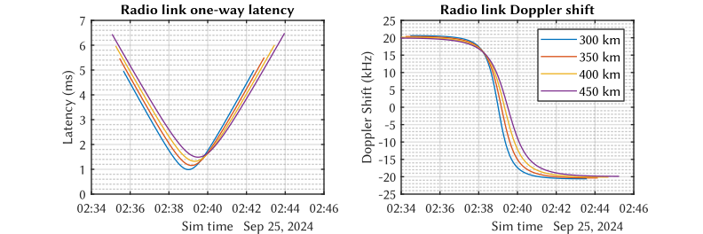

# Link Budget of a LoRa communications system in Low Earth Orbit (LEO)

This repository contains the MatLab source files for simulating a LoRa communications system in Low Earth Orbit (LEO). This code is part of my Master's thesis in telecommunications engineering from the Polytechnic University of Valencia in Spain (2024). The project's hardware design files are in this repository: [Hardware design of a LoRa Gateway and in-orbit computing payload for CubeSat.](https://github.com/dpmj/masters-thesis-lora-gateway-compute-module-cubesat-payload-pcb/).

## Files included in this repository:

- `lora_lb_base.m` provides a complete link budget and computes access intervals, azimuth, elevation, range, latency, Doppler frequency shift, FSPL losses, atmospheric losses, received power, and CNR in a sweep of orbit altitudes.
- `lora_lb_pfd.m` is a variant that establishes a power flux density limit on Earth. This script only calculates the received power and the carrier-to-noise ratio.
- `lora_lb_doppler_rate.m` computes the Doppler rate for LoRa packages and symbols for various spreading factors and orbit altitudes.
- `lora_lb_doppler_rate_pktsize.m` computes the Doppler rate for LoRa packages only, for several spreading factors and orbit altitudes, sweeping the size of the LoRa packet.

The code is comprehensively commented. However, the results are specific to the parameters of the case study in the Master's thesis. They may prove difficult to modify.

## Cite

```bibtex
@phdthesis{dpmj-master-thesis-2025,
    author = {{Del Pino Mena}, Juan},
    title = {Development of a {CubeSat} payload for in-orbit computing and {LoRa} communications},
    school = {Universitat Politècnica de València},
    year = {2025},
    month = {9},
    address = {València, Spain},
    type = {Master's thesis},
    doi = {https://doi.org/10.5281/zenodo.16641815}
}
```

# Example results










